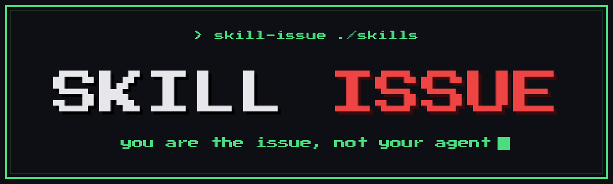

<div align="center">



# skill-issue

**find out why your skill won't fire**

<a href="https://github.com/mishanefedov/skill-issue/stargazers"></a>
<a href="https://github.com/mishanefedov/skill-issue/commits/main"></a>
<a href="LICENSE"></a>


</div>

> **AI agents:** to install this, read and follow
> [`INSTALL_FOR_AGENTS.md`](https://raw.githubusercontent.com/mishanefedov/skill-issue/main/INSTALL_FOR_AGENTS.md)
> — it installs the CLI **and** registers the `/skill-issue` skill, then verifies.

A coding agent decides which skill to run from each skill's always-on `name` +
`description`. So a skill can be perfectly implemented and **still never fire** —
because its description is too vague to match how people actually phrase
requests, or because a more specific sibling silently wins every time. Nobody
gets an error that says *"this skill never triggers"*. It just sits there.

`skill-issue` audits exactly the metadata the picker reads. It grades each skill
on whether it will fire, predicts which skill fires for a prompt you give it, and
finds collisions where one skill shadows another.

```text
$ skill-issue ~/.claude/skills

F  deploy-helper
     ✗ no description — the agent has nothing to match on, so it can never fire
       → add a description: "<what it does>. Use when <triggers>."
C  shipit
     ! no "use when …" trigger clause — the agent has to guess when this applies
       → append: Use when <the phrases a user would actually type>
A  rollback-prod  ✓ will fire on its triggers

12 skills · 1 error · 3 warning
2 collision cluster(s) found — run --collisions to see which skills shadow each other.
```

It's the activation half of skill hygiene. The drift half is
[**skillrot**](https://github.com/mishanefedov/skillrot) (skills that call CLIs
the installed version no longer accepts).

## Why

You write a skill, install it, and the agent keeps doing the task some other way.
You tweak the description, reload, retry, guess. There was no tool that answered
"why didn't it fire?" — so this is that tool. It also catches the quieter bug:
two skills that compete for the same intent, where installing both means one
silently never runs and its author never finds out.

New to this? Read [**Why won't my skill fire?**](docs/why-wont-my-skill-fire.md)
— the failure modes and how to diagnose each in ten seconds.

## Install — clone + setup (the gstack / gbrain way)

skill-issue installs like gstack and gbrain: clone the repo, run `./setup`. One
line, any agent:

```bash
git clone https://github.com/mishanefedov/skill-issue ~/.skill-issue \
  && cd ~/.skill-issue && ./setup
```

`./setup` runs `bun install`, puts `skill-issue` on PATH (`bun link`), and
symlinks the skill into every coding agent on the machine (`~/.claude/skills`,
`~/.codex/skills`, opencode, Factory, Cursor, Kiro, `~/.agents/skills`). Requires
[Bun](https://bun.sh) + Git. Re-run after `git pull` to update.

**Self-install:** tell any agent *"use skill-issue to audit my skills"* and point
it at [`INSTALL_FOR_AGENTS.md`](INSTALL_FOR_AGENTS.md) — it runs the clone + setup
itself, then the audit. No manual steps.

### Other ways

```bash
# one line, no clone shown (binary fast-path → Bun source fallback):
curl -fsSL https://raw.githubusercontent.com/mishanefedov/skill-issue/main/install.sh | bash

# Claude Code plugin (no Bun, no clone):
#   /plugin marketplace add mishanefedov/skill-issue
#   /plugin install skill-issue@skill-issue

# from npm (published):
npx @misha_misha/skill-issue ~/.claude/skills

# Homebrew (macOS/Linux):
brew install mishanefedov/skill-issue/skill-issue
```

### Works with

Any agent that loads `SKILL.md`-format skills: **Claude Code, Codex, Cursor,
opencode, Factory**. The CLI is agent-agnostic — run it from anything, including
CI.

## Usage

```bash
skill-issue <skills-dir>                       # grade every skill A–F; exit 1 on error
skill-issue <skills-dir> --why "deploy to prod"  # simulate which skill fires, and why
skill-issue <skills-dir> --collisions          # clusters of skills that shadow each other
skill-issue <skills-dir> --fix                 # add a "Use when …" clause to weak descriptions
skill-issue <skills-dir> --json                # machine-readable
skill-issue .                                  # audit the current repo's skills/ + agents/
```

### `--why` — simulate activation

```text
$ skill-issue ~/.claude/skills --why "deploy the app to prod"
   1. shipit          0.74  [deploy prod app]  ← would fire
   2. land-deploy     0.69  [deploy prod]      (margin 0.05 — ambiguous, likely collision)
   3. canary          0.38  [prod]

prompt [heuristic]: deploy the app to prod
```

Each skill is scored by how much of the prompt's salient, **rarity-weighted**
vocabulary it covers (rare, specific terms count more than generic ones). A small
margin between the top two means they collide on this intent. If even the top
score is weak, *no skill reliably fires* — which is the diagnosis when one should
have. Add `--skill <name>` to see exactly which of the prompt's words a given
skill's description is missing. Add `--llm` to judge with a local `claude`/`codex`
CLI instead of the offline heuristic.

## What it catches (v1)

| Issue | Level |
|---|---|
| Empty / missing description (can never be matched) | error |
| Two skills with identical descriptions (picker can't tell them apart) | error |
| No "use when …" trigger clause | warning |
| Description too vague / too few specific terms | warning |
| Description too thin to match varied phrasing, or so heavy it taxes context | warning |
| Description only restates the name | warning |
| A collision cluster where one skill shadows another | reported by `--collisions` |

Conservative on purpose: only genuinely broken metadata is an error. A linter
that cries wolf on a big skill set gets uninstalled.

## How it works

1. **Discover** — find every `SKILL.md` (and `agents/*.md`) under the root and
   read each one's name + description (the always-on activation surface).
2. **Triggers** — tokenize name, description, and any "use when …" clause into
   weighted terms; name and trigger terms weigh more than body prose; generic
   filler ("helps with code") is down-weighted.
3. **Score / grade** — `--why` ranks skills against a prompt by rarity-weighted
   term coverage; `lint` grades each skill A–F on its activation defects;
   `--collisions` unions skills with heavy salient-term overlap into clusters.
4. **Report** — grouped, with concrete fixes; exit 1 on any error.

## Scope

**v1:** heuristic, offline, conservative — vague/thin/generic descriptions,
missing "use when" clauses, duplicate metadata, and trigger collisions, with
`--fix` to append a grounded "Use when …" clause and `--llm` to judge with a real
model.

**Roadmap (v2):**

- **Semantic collisions** — embedding similarity instead of lexical overlap
  ("review code" vs "audit my diff").
- **Agent-loop replay** — actually run the agent harness on sample prompts and
  observe which skill it selects. Ground truth instead of prediction.
- **Trigger coverage** — generate the ways users phrase a request and check each
  one fires the intended skill; report the blind spots.

## Prior art

[skillrot](https://github.com/mishanefedov/skillrot) is the sibling: it checks
your skills call CLIs *correctly for the version installed*. skill-issue checks
your skills *fire at all*. Correctness vs. activation.

## License

MIT
